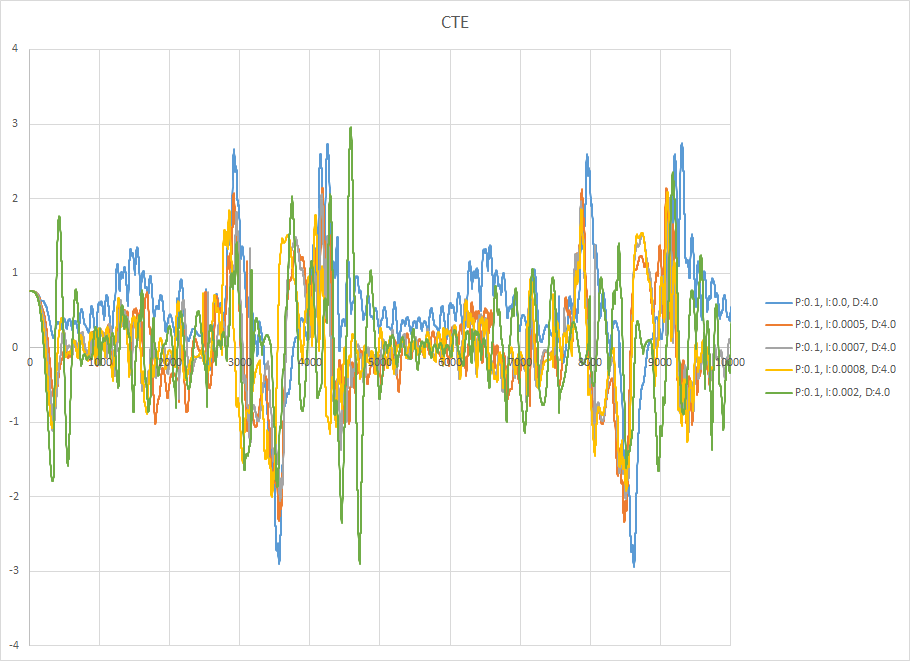

# CarND-Controls-PID
Self-Driving Car Engineer Nanodegree Program

---

## Objective

The purpose of this project is to implement a PID controller in C++ to maneuver the vehicle around the track from Behavioral Cloning Project.
The simulator provides cross track error and the velocity in mph.
P: proportional
I: integral
D: derivative
PID is commonly used to control signals from overshooting while converging to target output as quickly as possible.

## Basic Run Instructions

1. Run it: `./pid`.
2. Open simulator.

## Implementation

The base code of PID is based on Udacity course material.  For parameter tuning, it is discussed in the section below.

## Reflection

### Proportional

To start tuning the PID parameters, I start with manual method because using any automatic tuning requires the car to go around the track without major deviation.  Initially, all three parameters are set at zero, and slowly increase P.
P component affects how quick the car turns to minimize CTE.  It is a linear control since the feedback is Kp * cte.  If the car is on a straight track, the car will keep going left and right around the center like a sine wave.  If Kp is kept below a certain value, the car will be "stable" meaning the oscillation will maintain the same.  If Kp goes beyond a certain value, the oscillation will increase linearly, and the car at this point is not moving at a stable manner.
The plot below recorded the car on the track with different Kp values at 50 mph.  It can be seen that lower Kp values will keep the car on the track a little longer, but all of them oscillate quite a bit.

All three values are somewhat reasonable to start with, so I picked 0.1 for initial Kp.
All data, plots below are based on 2 laps on the track.

### Derivative

The D component reduces the oscillation induced from Kp.  This is used in signal control to minimize overshoot.  The feedback from D component is Kd * (current cte - previous cte).  When cte has big changes (bigger magnitude of slope), feedback is higher in magnitude to reduce the change in cte.
The plot below demonstrates the effect of increasing Kd.  The magnitude of oscillation is reduced with increasing Kd.  However, at Kd = 7.0, the car starts to oscillate with higher magnitude at certain long and sharp turns.

Another plot on varying Kd below looks at mean squared errors.  The error includes 2 laps on the track, minus error during initial acceleration.  As one can see, the error is high on both ends and low error region is from 2.5 to 5.5.  Picking absolute lowest error is not necessary because overall behavior needs to be considered as well, and it seems there are some random noises during the simulation so the car overcompensates at times. For further tuning, I picked Kd = 4.0.

### Integral

The I component reduces offset if the car tires are not aligned properly.  Vice versa, it should reduce cte if car tires are aligned, but the road turns.  The feedback from I component is Ki * (cte + prev cte + ...).  It makes sense that during a turn, if the car does not catch up quickly enough, the error accumulates through Ki, and the feedback will try to correct the offset.
The plot below shows the effect of increasing Ki.  It is quite clear that when Ki is non-zero, the cte is closer to zero because Ki compensated for the prolonged drift on the track.  From the plot (overall behavior), Ki of 0.0005 to 0.0008 are acceptable.  When Ki is 0.002, it compensates too much and more violent oscillation occurs at certain turn.

Another plot on varying Ki below looks at mean squared errors.  Cases with non-zero Ki seem to perform relatively well.  At the end, Ki of 0.0007 is picked for going forward.

This completes one round of parameter tuning.  To further tune the PID, we repeat the same process.

With Kp = 0.1, Ki = 0.0007, and Kd = 4.0, we vary Kp and check the response.  In the plot below, we can see there is minor reduction in oscillation when Kp is increased, until Kp = 0.25.  The car did not finish lap 2.  The car goes off road near the end of lap 2.  This can be contributed from random noise from the simulator.  That being said, there are still more high magnitude oscillations in general.

From mean squared error plot, both Kp = 0.15 and 0.2 show reduction in error.  At the end, Kp = 0.15 is selected.

With Kp = 0.15, Ki = 0.0007, and Kd = 4.0, we vary Kd and check the response.  In the plot below, we can see as Kd is increasing, the oscillation at bigger radius turns is smaller, but starts to oscillate more high sharper turns.

From mean squared error plot, error increases as Kd increases.  To consider both overall behavior and error, Kd of 4 or 6 are acceptable.
Final parameters: Kp = 0.15, Ki = 0.0007, and Kd = 6.0

### Twiddle

Twiddle seems like a convenient tool at first, but it does not help much in this case.  First, initial parameters can not be randomly chosen because the car will simply fall off track and not complete the necessary laps.  Second, there is not enough information from the simulator to determine number of laps.  This makes the error comparison difficult.  Third, when delta parameter values are set bigger, the car could go off track and not finish the laps.  If the delta parameter values are set smaller, the error could trapped in local minimum forever.
Due to the reasons above, the parameter tuning is done manually.

### Further Thoughts

No matter how well the PID is tuned, we will see the car oscillating at certain track path, and it is not acceptable in real world driving.  Likely there are cascade PID controls, one to look at cte, and the feedback goes to steering PID.  PID parameters probably change at different speeds, different behavior planning, which is tied to MPC (model predictive planning).

### Final Result

The link below shows 2 laps based on the final parameters: Kp = 0.15, Ki = 0.0007, and Kd = 6.0

<a href="video/Capture.mp4" target="_blank">Click for Video</a>